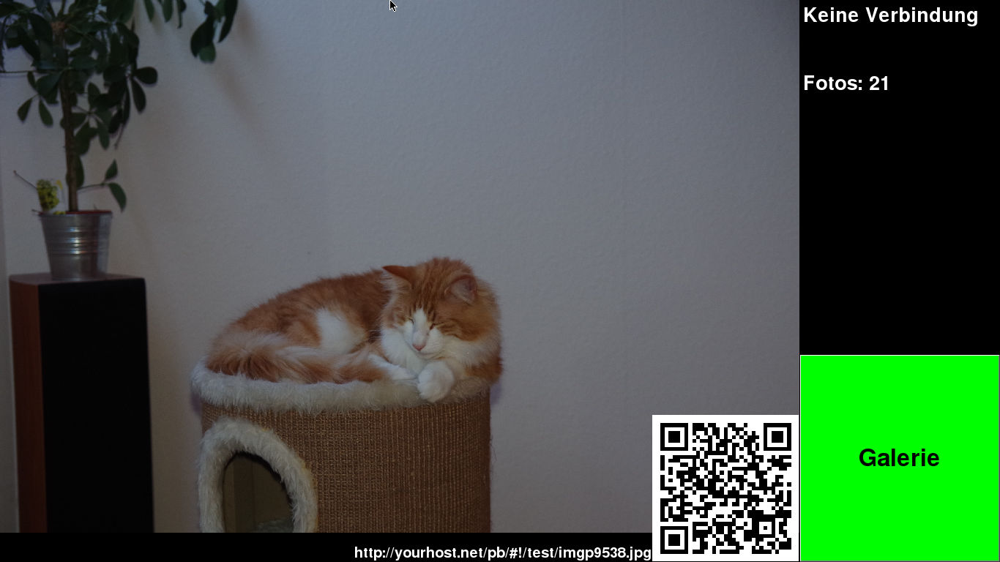
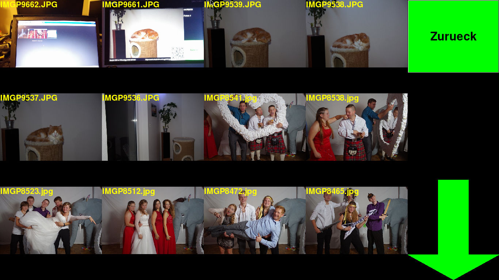

# photobooth
Photobooth software written in Python. Uses FlashAir WLAN SD-Card, touch display and photo printer.

My system setup looks like this:

* IR-Remote (for triggering the camera)
* Camera with FlashAir WLAN SD-card
* System with WLAN, Touchdisplay (or normal display and mouse)
* Photo printer

## Features

* Watch for new JPEG files on FlashAIR card
* Show newest image on display after capturing
* Create thumbnails for gallery
* Show all images in a simple gallery
* Resize image for printing (when required)
* Print an image on a connected printer (CUPS)
* Mark images as printed and add them to a list
* Opens HTTP port on 8080 to watch current screen and logfile from remote devices (smartphone)
* Resize image for web usage
* Upload image to static webserver gallery
* Show URL and QRCode of image in the webserver gallery
* Local HTTP supports showing the current image for remote screen (e.g. tablet on wall in another room)
* WhatsApp image serving support: You send an image number to a number running yowsup and get the image to your phone 
* Underexposure warning support
* Admin Telegram support (telepot): Receive errors and warnings, receive underexposed images

## Screenshots
**Main view**

**Gallery view**


## Requirements
* pygame
* pillow
* cups (for printing)
* paramiko (for web upload)
* rsync (for web upload)
* pyqrcode (for QRCode display)
* yowsup (WhatsApp support)
* telepot (Remote control and status)

## Installation
''TODO''

## Configuration
The configuration is done in the file *config*:
```
Name = Test
FlashAirAddress = 192.168.2.100
UploadHost = yourhost.net
UploadUser = webuser
UploadPath = /var/www/yourhost.net/public/pb
UploadSize = 1600
QRPath = http://yourhost.net/pb/#!/test
;WhatsAppNumber = 45123 456789
UEThreshold = 40
TGBotToken = abcdefgh
TGAdminId = 12345678
```

Unused values/features should be commented out with **;**

### *Name*
Required. Name of the current project. The images are saved in *images/***Name**. Also the web gallery folder uses this name.
### *FlashAirAddress*
Required. Address of the FlashAir card.
### *UploadHost*
Optional. Host were the image gallery should be uploaded to with rsync via ssh.
### *UploadUser*
Optional. SSH user. Has to be setup for key login (password login not supported)
### *UploadPath*
Optional. Path for image gallery
### *UploadSize*
Optional. Maximum pixel size of each side of the picture (1600 => maximum 1600x1600)
### *QRPath*
Optional. URL for QRCode generation, should point to image gallery
### *WhatsAppNumber*
Optional. Number of pbwa serving images. Only used for displaying text, pbwa is configured elsewhere.
### *UEThreshold*
Optional. Underexposure detection threshold in %. 40% means 40% of the image pixels are below a threshold.
### *TGBotToken*
Optional. Telegram bot token, used for admin Telegram bot interface
### *TGAdminId*
Optional. Telegram ID of admin user. If omitted, the user which sends *IamAdmin* to the bot, receives the status messages and underexposed images.
